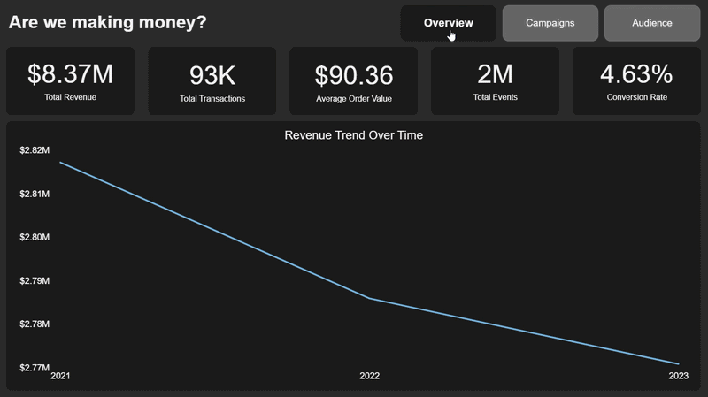
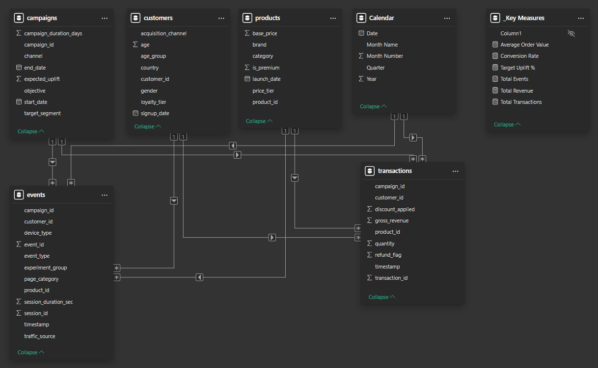
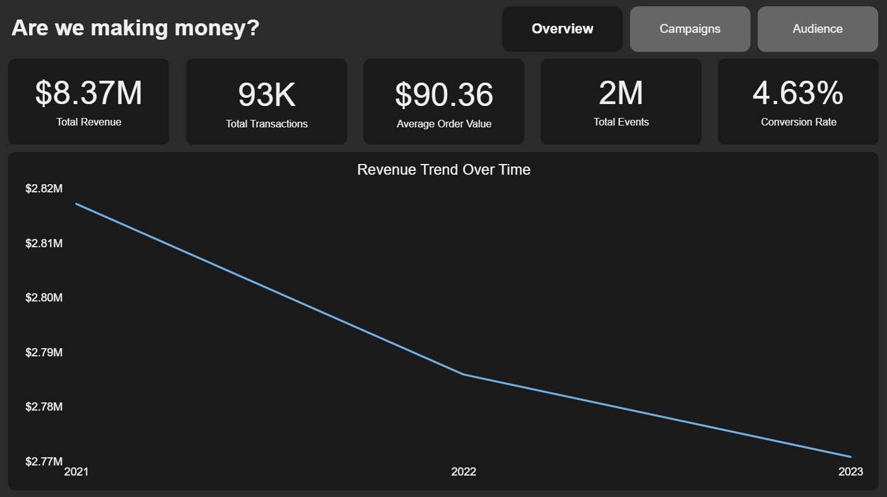
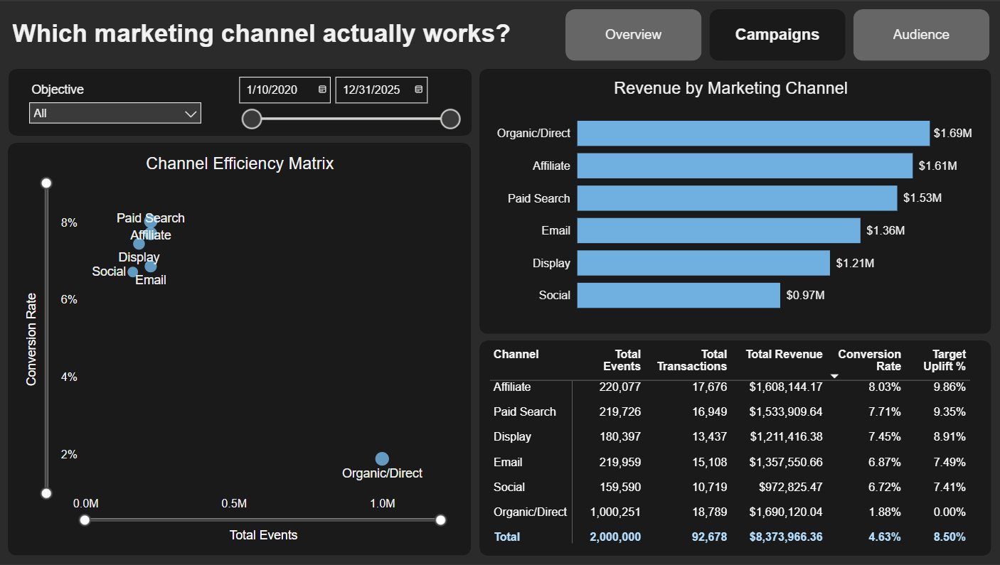
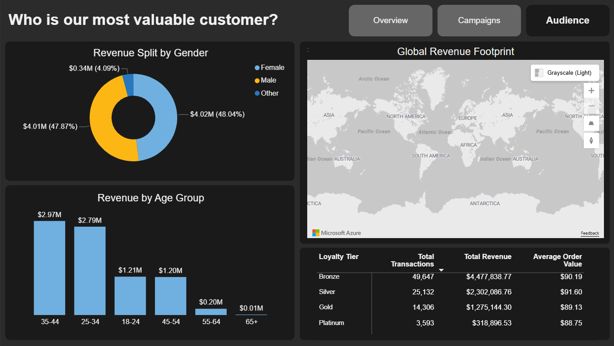

# 📊 Marketing Campaign Attribution & ROI: End-to-End Data Pipeline & Dashboard


 




### 👉 [Click Here to View the Live Interactive Dashboard](https://app.powerbi.com/view?r=eyJrIjoiYjE5ZTc4NzItYjE2Ny00ODM5LThiZTgtMzc0MWQ2YmI5NjVkIiwidCI6IjZiYTYzMzM5LTczNGYtNDdhMi05ZDhmLWY5NDk2YmM5NWI0MSIsImMiOjl9)


## 📋 Table of Contents
1. [Project Overview](#1--project-overview)
2. [The Business Problem](#2--the-business-problem)
3. [Tech Stack & Architecture](#3--tech-stack--architecture)
4. [Data Engineering & Database Setup](#4--data-engineering--database-setup)
5. [Data Modeling (Star Schema)](#5--data-modeling-star-schema)
6. [Dashboard & Key Insights](#6--dashboard--key-insights)
7. [How to Run This Project](#7--how-to-run-this-project)

## 1. 🚀 Project Overview
This project is an end-to-end data analytics portfolio piece designed to simulate a real-world enterprise environment. Utilizing a comprehensive [Marketing and E-Commerce Analytics Dataset from Kaggle](https://www.kaggle.com/datasets/geethasagarbonthu/marketing-and-e-commerce-analytics-dataset), I engineered a relational database warehouse in PostgreSQL and built an interactive, executive-facing Power BI dashboard. 

The primary goal of this project is to provide a Chief Marketing Officer (CMO) with a unified, actionable view of campaign ROI, marketing channel attribution, and customer demographic spending habits.

## 2. 🎯 The Business Problem
In the modern e-commerce landscape, marketing teams often suffer from "data silos." Website traffic data (top-of-funnel events) is frequently disconnected from actual sales data (bottom-of-funnel transactions). This disconnect makes it impossible to calculate true Return on Investment (ROI) or accurately map the user journey.

For this project, I acted as the lead Data Analyst for a Chief Marketing Officer (CMO). The CMO was running multiple marketing campaigns across various channels (Email, Social, Paid Search, Affiliate) and needed a unified reporting system to answer three critical questions:

1. **The Executive Check:** Are we actually making money? 
2. **The Attribution Problem:** Which marketing channels drive traffic, which channels actually drive revenue, and did they meet our target goals?
3. **The Demographic Target:** Who is our most valuable customer, and where do they live?

## 3. 🛠️ Tech Stack & Architecture
To make this portfolio piece as realistic as possible, I built a true end-to-end data pipeline to process the raw Kaggle dataset.

* **Python (Pandas):** Utilized for initial data extraction, cleaning, and preparation of the raw CSV files.
* **PostgreSQL (pgAdmin4):** Served as the backend data warehouse. I engineered a normalized relational database utilizing strict Primary Key (PK) and Foreign Key (FK) constraints to ensure data integrity before visualization.
* **Power Query (M Code):** Used for the "last mile" ETL process. This included resolving backend data-type mismatches (e.g., stripping timestamp data to pure dates for accurate relational table joins).
* **Power BI & DAX:** Used for frontend data modeling (building an optimized Star Schema) and designing the interactive dashboard.

## 4. ⚙️ Data Engineering & Database Setup
To simulate a true enterprise environment, the raw Kaggle dataset was first processed and loaded into a normalized **PostgreSQL** relational database. 

* **Volume & Scale:** The database handles over 2,000,000 top-of-funnel site events and 93,000 bottom-of-funnel completed transactions.
* **Relational Integrity:** Instead of relying on flat files, the data was structured into distinct Dimension tables (`campaigns`, `customers`, `products`) and Fact tables (`events`, `transactions`).
* **ETL Pipeline:** Power Query was utilized to extract the data from PostgreSQL, perform final cleaning steps (such as stripping redundant timestamps to pure `Date` types to fix engine join errors), and load it into the Power BI Data Model.

## 5. 🕸️ Data Modeling (Star Schema)
Inside Power BI, the relational database was transformed into a highly optimized **Star Schema**. This architecture ensures rapid calculation speeds across millions of rows and provides intuitive, directional filtering.



### The "Waterfall" Filter & The Master Calendar
A common issue in Power BI is filtering across multiple Fact tables. To ensure that slicing by date filtered both the `events` table (traffic) and the `transactions` table (revenue) simultaneously, a master **Calendar Table** was generated using DAX and connected to both Fact tables.

### Key DAX Measures
A dedicated `_Key Measures` table was created to house the core business logic, keeping the model clean and organized.

```dax
Average Order Value = DIVIDE([Total Revenue], [Total Transactions], 0)

Conversion Rate = DIVIDE([Total Transactions], COUNTROWS(events), 0)

Target Uplift % = AVERAGE(campaigns[expected_uplift])

Total Events = COUNTROWS(events)

Total Revenue = SUM(transactions[gross_revenue])

Total Transactions = DISTINCTCOUNT(transactions[transaction_id])

```

## 6. 💡 Dashboard & Key Insights
The final Power BI dashboard was designed with a dark-mode, executive-ready UI. It is broken down into three core pages:

### Page 1: Executive Overview
Designed for the CMO to gauge overall business health in under 5 seconds.

* **Insight:** The business generated $8.37M in revenue from 93K transactions, maintaining a solid Average Order Value of $90.36. 
* **Insight:** The overall Conversion Rate sits at 4.63%, but the timeline trend reveals a slight downward trajectory in revenue year-over-year.
* **Recommendation:** Conduct an immediate audit of the highest-spending campaigns from the previous two quarters to identify the root cause of the downward revenue trend and stabilize top-line growth.

### Page 2: Campaign Attribution
A deep dive into channel efficiency utilizing a custom scatter plot matrix.

* **Insight (The "Volume Monster"):** `Organic/Direct` drives the most total revenue ($1.69M) but suffers from a terrible conversion rate (1.88%). It acts as a massive net for window-shoppers. 
* **Insight (The "Snipers"):** `Affiliate` and `Paid Search` drive a fraction of the traffic but convert at roughly 8%. 
* **Recommendation:** Shift budget away from buying sheer volume and pour it into Affiliate marketing to scale highly qualified, high-intent traffic.

### Page 3: Audience Demographics
Customer-centric targeting metrics to refine future ad spend and targeting.
 
* **Insight:** Revenue is split perfectly evenly between Male and Female demographics (~48% each), meaning campaigns do not need to be heavily gender-gated.
* **Insight:** The 25-44 age bracket makes up the vast majority of purchasing power.
* **Insight:** While "Bronze" tier loyalty members generate the highest *total* volume, the Average Order Value remains remarkably flat across all loyalty tiers (~$88-$91). 
* **Recommendation:** The VIP/Platinum rewards program is currently failing to incentivize larger basket sizes and needs a complete restructuring.

## 7. 🚀 How to Run This Project
*Note: Due to GitHub's file size limits, the ~360MB dataset (raw and processed CSVs) is not included in this repository. You must download the data locally to run the pipeline.*

If you would like to explore the backend data pipeline or view the dashboard locally, follow these steps:

1. **Clone the Repository:** Clone this project to your local machine.
2. **Download the Data:** Download the raw dataset from [Kaggle](https://www.kaggle.com/datasets/geethasagarbonthu/marketing-and-e-commerce-analytics-dataset) and extract the CSV files into a local `dataset/raw/` folder.
3. **Run the Python Pipeline:** Navigate to the `/python` folder and run `inspection.ipynb` to clean the raw data and export it to a new `dataset/processed/` folder.
4. **Build the Database:** Open pgAdmin4 (or your preferred PostgreSQL client) and execute the `creating_tables.sql` script located in the `/SQL` folder to build the empty relational schema.
5. **Import the Data:** Import the cleaned CSV files from your `/dataset/processed/` folder into their corresponding PostgreSQL tables.
6. **Open the Dashboard:** Navigate to the `/Power_BI` folder and open `marketing-campaign-attribution-dashboard.pbix` in Power BI Desktop.
7. **Connect Your Local Server:** If prompted, go to **Transform Data** -> **Data source settings**, update the connection string to point to your local PostgreSQL credentials, and click **Refresh** to load the data model.


